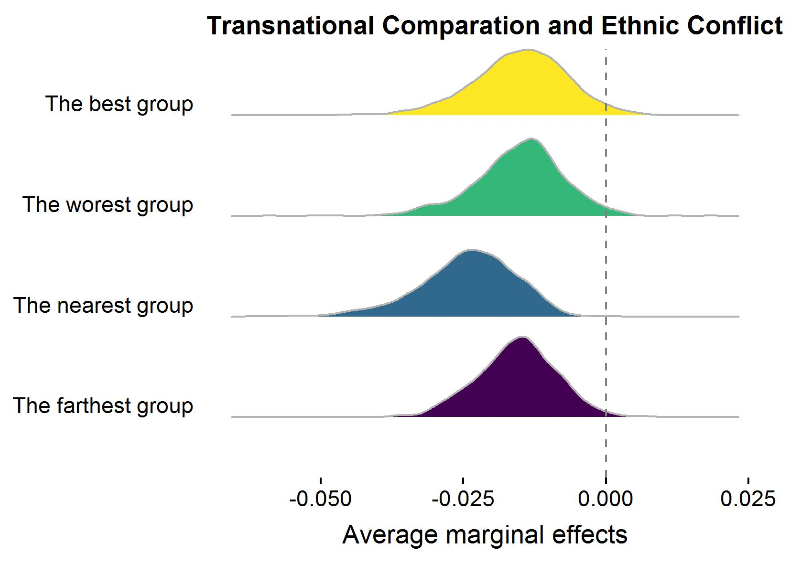
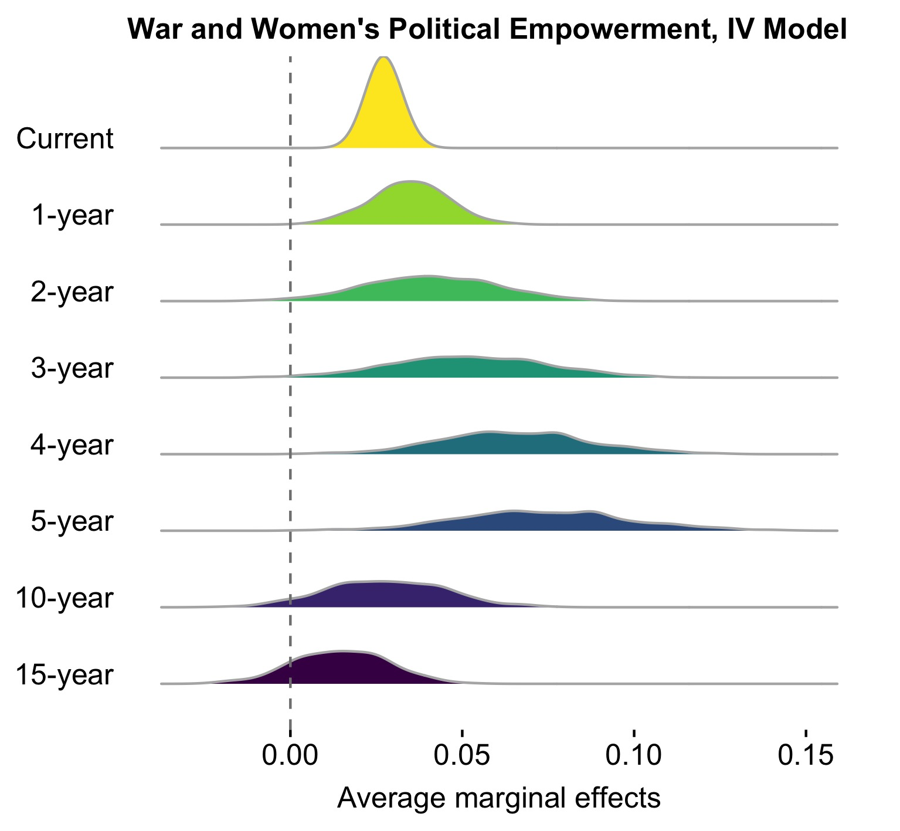

#postregplots: An R Package for Visualizing Simulation-based Marginal Effects from Generalized Linear Models

*postregplots* implements a set of functions for visualizing simulation-based marginal effects from generalized linear models.

Compare simulation-based marginal effects for different variables across different models. 

 

Compare simulation-based marginal effects for the same variable across different models. 

 

Install: the latest development version
-----
```r
library(devtools)
install_github("cc458/postregplots")
```

```r
# estimate model
# model 1
b1 <- bayesglm(initiation ~ tgt_landneighbors2 +  backdown_terr1 +  
                            backdown_nonterr1 + joint_demo +  defensetgt +
                            offensechal +  land_neighbor + vicratio + 
                            tmid +  tmid_sq + tmid_cub, data = data, 
                            family = binomial(link = "logit"),
          prior.scale=2.5, prior.df=1)
          
# model 2
# model 2: 
b2 <- bayesglm(initiation ~ tgt_landneighbors2 +  backdown_terr1 + 
                     backdown_nonterr1 + joint_demo +  pot_milicapchal +  
                     pot_milicaptgt +  land_neighbor + tmid +  tmid_sq + 
                     tmid_cub, data = data, family = binomial(link = "logit"),
               prior.scale=2.5, prior.df=1)
# make a coeffiicent plot based on simulation                
coef_f1 <- coef_clusterplot(ModelResults = b1,
                            varnames = c("tgt_landneighbors2","backdown_terr1",
                                         "backdown_nonterr1", "joint_demo",
                                         "defensetgt", "offensechal",
                                         "land_neighbor","vicratio"),
                            data = data, 
                            clusterid = "ddyad") + 
       scale_x_discrete(labels=c("Past yielding (nonterritory)", "Past yielding",
                                 "Defensive alliance (target)", "Joint democracy",
                                 "Land neighbor", "Offensive alliance (challenger)",
                                 "Num. of land neighbors",
                                 "Exp. victory prob. ratio")) + 
       theme(axis.text = element_text(size=14),
             plot.title = element_text(hjust = 0.5,size = 30, face = "bold"),
             axis.title=element_text(size=14)) + 
       ggtitle("")

# make ROC plot
roc <- plot_roc(ModelResults = list(b1, b2), 
                linetypes = c("solid", "dotted"), interval=0.2)
```


Contact
-----
- email: Chong Chen <chong.chen@duke.edu>
