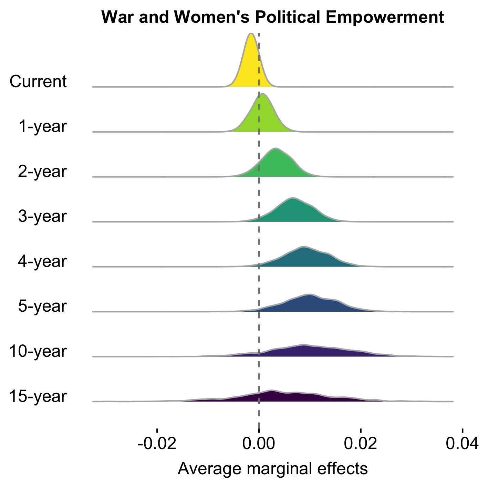

#postregplots: An R Package for Visualizing Simulation-based Marginal Effects from Generalized Linear Models

*postregplots* implements a set of functions for visualizing simulation-based marginal effects from generalized linear models.

 />

 />

Install: the latest development version
-----
```r
library(devtools)
install_github("cc458/postregplots")
```

Contact
-----
- email: Chong Chen <chong.chen@duke.edu>
